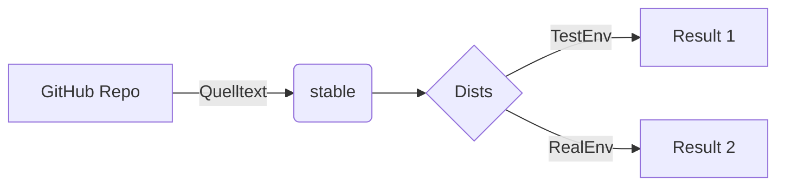
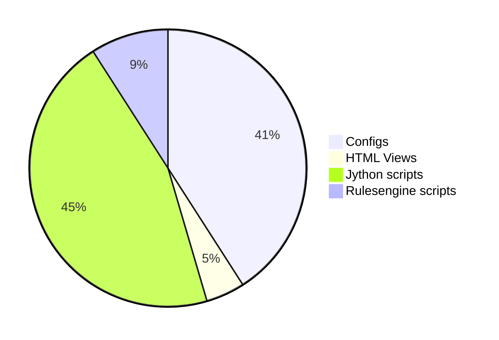
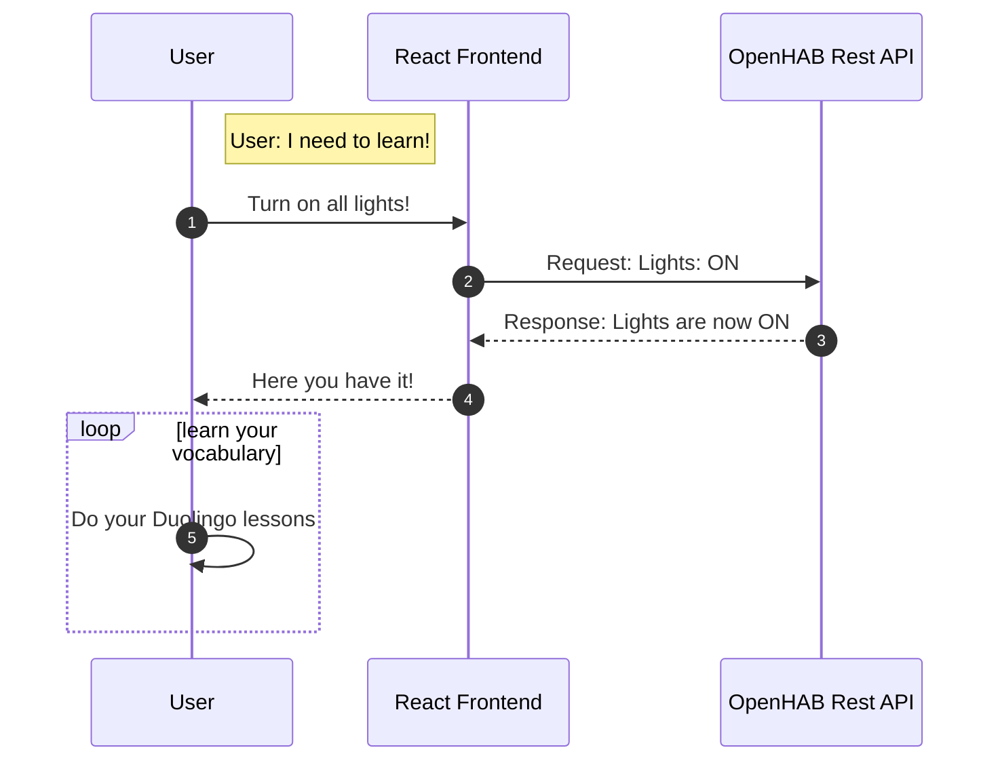
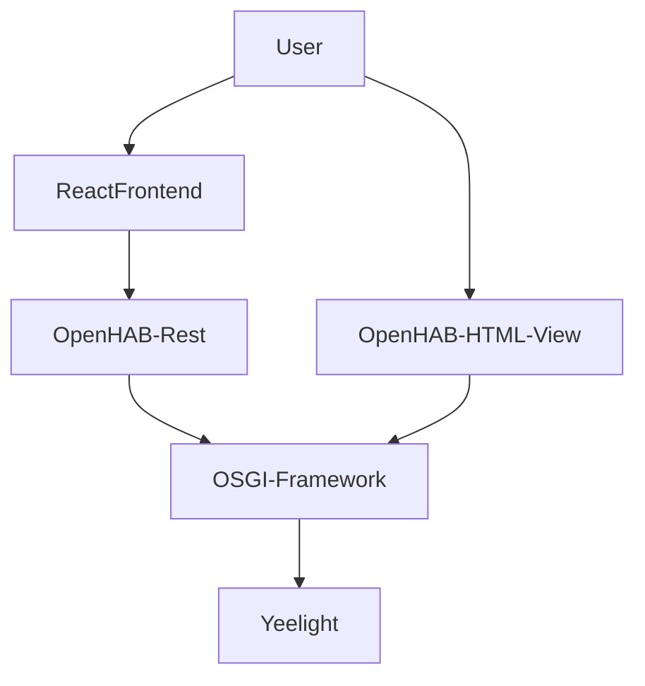

<div align="center">
<a href="https://github.com/NicoFilips/ByteBrusher/">
  
</a>

<blockquote>
  <p>Source: DALL-E 3</p>
</blockquote>

 [](https://github.com/NicoFilips/smarthome-openhab/actions/workflows/docker-image.yml)


# :rocket: My Smarthome configuration April-2022 :house:

This Repository shows the configuration of my SmartHome. 
It also helps me to review Changes or revert my current state back. This configuration is running on a Raspberry Pi 3b with 4GB and an attached SSD. 
This Setup is also running in the cloud so I have access to all those features without beeing in my own network or having to set up a VPN.

## Quick Summary of my Environment and Devices:
- a lot of LED Strips
- Yeelights RGB Bulbs
- 2 yeelight ceiling lights
- Zigbee door, window sensors
- Zigbee Temperature, humidity Sensors
- 2 Amazon Alexas
- Wake-On-Lan on several IP Based devices
- A vacuum robot
- some sonoffs (flashed with Tasmota)
- DECT FritzBox radiator thermostat
- Miflora to monitor my plants
- IP based printer
- 3D Printer with Octoprint (Raspbi App)
- IR Remote (controlling sound system and TV)
- Kodi Mediaserver on a raspberry

## Services I coded:
- Alarmclock (activates Amazon Alexa and lights in the morning)
- discolights (LED strips, smart bulbs and ceiling light) synced to music
- Serverlogs stored in things to view them on the UI
- local weather data grabbed of a public API
- server stats (cpu temp etc.)
- telegram bot
- whatsapp bot (based on yowsup) controlling my smarthome via whatsapp bot
- todo list
- Tankerkönig - an API to get the cheapest gas prices in the near area
- Speedtest - measure current upload and download speeds

Changes are made in a seperate envrionment. Those changes are tested and validated. As soon as it's safe to say that they work accordingly and don't have any sideeffects on other domains, their pushed to the 'production' -> therefore the real image of my raspberry pi. 



Benefits:
- safeguarding against failure
- Keeping the production code tidy
- Test without effecting real devices
- Learn to use Git!


## My Setup roughly contains:


## Usuall process of shipping a feature:
Common scenario: A parcel arrived and I received a new smarthome device!
At first we need to create a feature branche, to ensure we're not working on our main branche and production setup. So we connect our devices, code some stuff, do some magic. You know how it works.
When tested succesfully, we commit and push our awesome changes to the feature branche. 
Now we create a pull request to merch our changes and the ability to handle the new devices into our develop branche.
As soon as everything works and and the changes can be merged, we go for it!

```
$ git clone https://github.com/NicoFilips/OpenHAB
```
Ive you use my configuration, and decide to ship changes as well, you can achieve this with these commands:
```
git status
git add .
git commit
git push origin main
```
Its recommended to put a feature into a feature branche.
Keep in mind tho, that your configuration will likely have different devices. So use this as a template and change the important ids to match your devices.
And don't forget to have doing it!

## Ecosystem:
This Smarthome setup isnt my only running server. This Server implements a REST-API. I'm also working on a node.js Frontend with Typescript and React. With this setup I can control my Smarthome Server Backend, by changing the states of my devices.
It works pretty much like this:


In conclusion, the way of communication is often the same. It doesnt make a difference if connected to the REST API or with the SmartHome View des Smarthome Servers directly, it aufs selbe raus. 
The state of my Smarthome.


## Deployment:

This Repository is automatically build into a docker image. Having an isolated docker image makes the deployment simpler and fast.
The magic is happening in the deployment pipeline. You can explore the pipeline yourself in the .github/workflow folder.
The generated container is stored in the ghcr. (github container registry)
When it's time to ship a new feature or fix a bug, one just needs to push the changes into main. The Pipeline will then do its Job and build a docker image on top of your changes.
Keep in mind that the pipeline can take some time to generate the docker image. 
When built, just grab it off the container registry and deploy it onto your device.

## Contact:
If you have any questions regarding this repository, just feel free to contact me.

## Disclaimer:
I've checked every id. Don't even think about investing time to do anything harmful with those.
Save the time - it won't work.

## Note:
I also have an ender 3 with octopi running. I flashed the mainboard of the 3d printer with an arduino uno. (let me tell you, it was a mess!) But so I could install octopi on a seperate Raspberry Pi.
Thanks to flashing the board, I could access the printers data over the USB Port. Octopi also implements a REST API and I'm able to control it with my SmartHome.
I even coded some scripts on my 3d-printer to adjust the start up, level the bed (I've installed a bl-touch) or preheat the bed before a print. I also installed a webcam to monitor my prints! 
Also, connecting octopi to the cloud, I could monitor the status of my prints or even cancel failed prints on the go.

### Powered by:   
